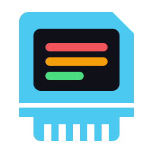

<p align="center"></p>

# Multi-System Emulator

[](https://github.com/RileyWebb/mse/actions)


[![SDL3](https://img.shields.io/badge/SDL3-173F5F?style=flat&logo=data%3Aimage%2Fpng%3Bbase64%2CiVBORw0KGgoAAAANSUhEUgAAADoAAAAcCAYAAAAwTqwDAAAGdklEQVR42sWZa4zdVRXFf%2Bt%2F5860TktfWEXkVQ0RilhFRYIPHkKJhMTEGE1MiEiMpokfjNj4RQUixlcM4QNooiZ%2BkcSYoCEqEkgTpFqMD7Q0gJYy1oLaUjttWtqZ%2B1h%2BWac5Xu%2FcmenYeJKb%2F%2Bucfc7eZ%2B219z5XtiXJALbfCnwIuBJ4LTABnAD%2BCewCtgPbJD1n%2B3zgdv67GZgB%2FgXsA54CnpA0kzkESFLf9kbgM0APUH53SNpbr2u%2BZns5sFbSC%2FN1PMP2d2zPeP522PYVtt%2Fghbddtj9lu8l87VzfN6TvW%2FKtYYHNtmy3bK%2ByvX7Y%2BMb2SuAh4FZgPNadq3WAM4Azs2s9oJtrb47d7QEXA%2FcAj9heW%2FXt5H52HjkjmyRL6gWB5%2BRdv%2B4zBnweuCKTjQEt4AfA%2FYHsCmAjcCNwXcbNBmatKEOefwy8ACzPhO%2FO5N30uxr4SeScAJrIIPcFvqfUJO0H9tu%2BCjggaddJF7C913bP9myg88AIiLzN9g7bN9m%2BIP37GW%2Fblw%2F0v8j2tnzrVa5x%2BwB0u5Fj25sWC91qvlZgfIPtD9temWcRnyuT2fYjxYcqAW3b49X9pO1NQxTdbHvM9rjtViGK%2BGjfdid9D9mesH3N%2F1LRiuzKvBuKog1wCOgHOgauBZ6w%2FQXb19s%2BS1JH0myRJelYBbm69SR1c%2B3ZHpd0HPhyBUsDq4F3AMc4DS1GaoBPA5dJcgM8kJedikDeDNwB%2FAJ42vZjtrfaPltSN4IWQv3dWHh7%2FLoVo5Y5eqdD0RBROzxxse2JBrgT%2BF0YVxULzuZ%2BFfAu4KvAn2x%2FMoIWAi0nFh4CjtRrCXOfDiUdApoGPhDS29BIOgS8F7gvixmL0uPZgW4VRtYC99m%2BEZhexPzNEKh3Oc0tIec4cF5juy1pWtIW4I2Jp99PRjNThZyxLK4PbAWWVbsz51yB%2BVlBhiv3%2BNvpVtT2rcBHgNWNpE5ejkvaK%2Bl7kj4KXApclBTtaBZXnPwC4NUj%2FFTxzXZg%2Fv6M68VoAh4PauYaq8KYJ0PEIjYz15uBm4AVje2v2V5VWDWhYQJoSXpe0jcDay2CPPrJVmZsXwLcVhmlAZ6U9CywcsTYXq4nf6fAvDcDd5VJPwv81vbHba%2BTNCtpJmEC25PAmyrI9YGpZE1zWXnc9nrbtwCPAmsyrrStldKDrZ1YPZFr%2BZ2MzQskwT5wblzshGyfSJoGcAD4TSqVI4HntYFwL4ttAx8Efg88F%2BWLwlOJjRPAuihYctqShHxR0p0x4vUJYTWL7ws3aIC42sA9ku623QrRjEoaLgWuAV4FPERVNXRHVB%2F1t3sj7LK87%2BQ6bHy%2Fuj9u%2B7biHrlel3GzI2TU7a6MG5snBfx6%2Bj9p%2B3O2z2yAr4RhR8GiBTwN3CJpSyzWqti4Ncf4AvNvA2%2BX9I2yyMgoIaw9QsZgETJPRJFTWBxOaPmjpJdUOe4lyVZen3jZDgz%2FmoRih6SO7SZF80rg8gqSxee6gepRYJ%2BkF0dAbDXwzhikUxmtF7mdKqw1wLOSdg8rysu7EOkngE3AbuBu4LhsjxXiWUh1UFjR9rKUXQcisJNs6nXJRvYCVwGTwN%2BB%2FTHcGuA1wPOx%2BHSUuxr4Szm9kDRle1LSsRIFgDFJR4b5ZNa0HPhYys6X4tN7bEv18caItM6VgoUkXgncG2d%2FMVZfkZCxBvhWyGxjEDIFnA08kzh8KHXruhhmMsrsiJGWJ2Mr%2FdZm4T8ayLXLscxjSSsfDSK%2BK2lnQaCWkHWMhY3b2RUDm4Ffxvf%2BUYWVPvAysD6MOh5Wd04smvRZnrOmY8CFwMGcTvwhRtyZ2Pwf0M351f2B%2BYPADyU9U5RkKdX8%2F6tVMG2i2JXAe2KsPcBPJR2olVyyovMUxx6Q70XM56o%2Bpqple1HyQuDh7N7%2B8MOvge2ljBx2ZrTUum%2B%2BBY96nst4KpnUAEQnbG8IU%2B8O%2FH%2BVlPJgteP9uZLfxe7kONCZK%2F8shDWwyGHvmmKwYd8rpv85sBPYBmwIQT0F7JF0uMgaZfhT3dHVIYpedYA8c9Lxhxhgjnf9we85YJuO%2FHPDylN5ngZ%2Blvh8YsCA%2FYWUM0slhvMTK2fzvB5YlhP3kmCcA7ws6WCJ3bY3h53%2FHIUa4EvJwh4GXhHlpoCj8yFkKSnVSAXLJJKm6smTOAwa8zzgoO3DwArb3YSf2SBkPLF4Sykgyt8Yg8otRsHS%2Fg0EBjWIgeKDbQAAAABJRU5ErkJggg%3D%3D)](https://github.com/libsdl-org/SDL)
[](https://cmake.org)

MSE is a multi-system emulator frontend written in C11. Emulator cores are
plugins loaded at runtime. The frontend owns the window, the GPU and the UI, and
is built on SDL3 and Dear ImGui (through cimgui).

## Features

- **Pluggable backends.** Each system is a shared library the frontend loads at
  startup.
- **Game library** with metadata and cover art, cached in SQLite.
- **Lua scripting.** Backends can ship their own ImGui panels and in-game
  overlays, written in LuaJIT.
- **Debugging tools**: CPU, PPU and memory viewers, cheats, and TAS movie
  playback.
- **Built-in profiler** (F9) and a console for commands and cvars (F10 or `` ` ``).

## Components

| Component | What it is | Source |
| --- | --- | --- |
| **libmse** | The library that backends and the frontend share: backend loading, cvars, console, input, game library. | [RileyWebb/libmse](https://github.com/RileyWebb/libmse) (submodule at [`libmse/`](libmse)) |
| **cNES** | Nintendo Entertainment System backend. See [its README](backends/cnes/README.md). | [`backends/cnes/`](backends/cnes) |

## Building

### Recommended toolchain

| | Windows | Linux |
| --- | --- | --- |
| **Compiler** | **GCC** via [MinGW-w64](https://www.mingw-w64.org/) | **GCC** |
| **Generator** | `MinGW Makefiles` | Makefiles (default) or Ninja |
| **Build type** | `RelWithDebInfo` | `RelWithDebInfo` |

**Use GCC.** CI builds only with GCC on both platforms, so it's the only
compiler we know works. Clang and MSVC may work but aren't tested.

You also need:

- Git
- CMake 4.1 or newer
- On Linux, the X11/Wayland development packages and the Vulkan headers.
  [The CI workflow](.github/workflows/cmake-multi-platform.yml) lists the exact
  packages.

CMake fetches the other dependencies (SDL3, cimgui, cimplot, LuaJIT, SQLite,
minizip-ng, stb and a few Lua libraries) while it configures, so the first
configure takes a while.

### Steps

```sh
git clone --recursive https://github.com/RileyWebb/mse
cd mse
# or, in an existing clone:
git submodule update --init --recursive

# Windows (MinGW-w64)
cmake -B build -G "MinGW Makefiles" -DCMAKE_C_COMPILER=gcc -DCMAKE_BUILD_TYPE=RelWithDebInfo
# Linux
cmake -B build -DCMAKE_C_COMPILER=gcc -DCMAKE_BUILD_TYPE=RelWithDebInfo

cmake --build build
```

Everything is built into `bin/`, which is also the directory to run from:

```sh
cd bin
./mse [options] [rom]
```

`mse --help` lists the command-line options. Any cvar can be set at startup
with `--set name=value`.

### Tests

```sh
ctest --test-dir build              # everything
ctest --test-dir build -LE slow     # skip the long AccuracyCoin run
```

## Keys

| Key | Action |
| --- | --- |
| F5 | Pause / resume |
| F9 | Profiler |
| F10 or `` ` `` | Console |
| F11 | Fullscreen |

## Folder structure

```
mse/
├── libmse/                  shared library (git submodule → RileyWebb/libmse)
│   ├── include/libmse/      public headers; everything here is prefixed libmse_
│   ├── src/                 backend loader, cvars, console, input, library, profiler
│   └── data/lua/            metadata scraper, cover art, cvar helpers
├── frontend/                the mse application
│   ├── src/                 SDL3 + cimgui UI, input, library view, console
│   ├── lua/                 Lua UI API that backend panels are written against
│   ├── tests/               headless tests, including panel_smoke.lua
│   └── cmake/               SDL, cimgui and LuaJIT fetch scripts
├── backends/
│   └── cnes/                NES backend
│       ├── src/             CPU, PPU, APU, mappers, plus backend.c (plugin glue)
│       ├── include/cNES/    core headers; external/ holds the debug ABI the UI uses
│       ├── data/lua/        panels (ui/), overlays (overlays/), per-game scripts (games/)
│       └── tests/           test ROM suites, headless runner and baselines
├── data/                    fonts, shaders and LUA_API.md
├── bin/                     build output and runtime working directory
└── .github/workflows/       CI
```

A new backend goes in its own folder under `backends/`. It builds as a shared
library into `bin/`, where the frontend finds it at startup.

To write code for the project, read [AGENTS.md](AGENTS.md) first. It covers
naming, comments and header conventions.

## Progress

The progress of each backend is tracked in its own README ([cNES](backends/cnes/README.md)).

- [x] Runtime-loaded backend plugins
- [x] Game library with SQLite cache
- [x] Metadata scraping and cover art
- [x] Lua panels and in-game overlays
- [x] Console and cvars
- [x] Profiler
- [x] Controller configuration
- [x] All dependencies fetched by CMake
- [ ] Automatic backend updates

## Licence

MIT. See [LICENCE](LICENCE).

## Credits

MSE uses SDL3, Dear ImGui, LuaJIT, SQLite and other open-source projects, along
with two fonts. [CREDITS](CREDITS.md) lists them all, with their authors and
licences. Each backend credits its own resources in its folder, for example
[cNES](backends/cnes/CREDITS.md).
